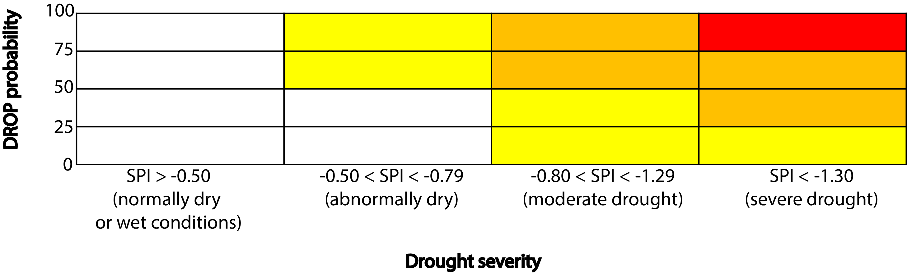

### The DROP dataset

DROP is  global land gridded dataset to monitoring DROught from Probabilistic approach. This enhances previously available climate datasets, which were static in nature or that not provide uncertainty estimations. An ensemble approach, similarly to weather/climate prediction studies, has been applied for DROP, where the members are different observations-based products (see following Table).
 

DroP is available from https://earth.bsc.es/gitlab/mturco/drop from January 1981 to December 2019, which will be extended to near real-time as additional months of data become available. Files were created in NetCDF format following the Climate metadata standards. DROP provides information in a variety of ways:
 
- SPI values. The ensemble mean of DROP provides the values of the SPI index. This could be of use for user that need to quantify the drought conditions. 
 
- SPI spread. The ensemble spread of DROP gives an estimation of the uncertainties of the observed SPI index.
 
- SPI warning level. This map is designed to allow users to distinguish between high drought severity with high probability and low severity and low probability. That is, the colours indicate a combination of probability and severity as indicated in the table below: 
 
 

  

 
For example, yellow could reflect either a high probability of abnormally dry conditions or a low probability of a severe drought. This approach is based on the 
guidelines for disaster management of the European Commission (EC 2010).
- SPI probability of drought level. This map shows the full probability of having (at least) moderate drought, thus giving a more detailed illustration of the DROP uncertainty and could be useful for the most experienced users.

### Input data

The following table indicate the individual ensemble member that constitutes the DROP dataset

| Dataset  | Source |
| :------------ |:---------------|
| CAMS\_OPI | http://www.cpc.ncep.noaa.gov/products/global_precip/html/wpage.cams_opi.html       |
| CHIRPS      | http://chg.geog.ucsb.edu/data/chirps/        |
| CPC | https://www.esrl.noaa.gov/psd/data/gridded/data.cpc.globalprecip.html        |
| ERA5  | https://www.ecmwf.int/en/forecasts/datasets/archive-datasets/reanalysis-datasets/era5      |
| GPCC  | https://www.dwd.de/EN/ourservices/gpcc/gpcc.html      |
| GPCP (V2.3)      | http://eagle1.umd.edu/GPCP_ICDR/Data/ |
| JRA-55  | http://jra.kishou.go.jp/JRA-55/index_en.html      |
| MERRA2  | https://www.esrl.noaa.gov/psd/data/gridded/data.ncep.reanalysis2.html      |
| NCEP  | https://www.esrl.noaa.gov/psd/data/gridded/data.ncep.reanalysis2.html     |
| PREC/L | https://www.esrl.noaa.gov/psd/data/gridded/data.precl.html       |

 

 

### Acknowledgments
This work has received funding from the European Union's Horizon 2020 research and innovation programme under the Marie Skłodowska-Curie grant agreement No. 740073 (CLIM4CROP project);
from the Spanish Ministry of Science, Innovation and Universities through the project PREDFIRE (RTI2018-099711-J-I00); from the FundaciónSéneca - Regional Agency for Science and Technology of Murcia through the CLIMAX project (20642/JLI/18); 
from the Plan Propio de Investigación of the University of Murcia (grant No. UMU-2017-10604). 
The authors thank the data provider listed in the previous Table for providing access to these datasets. Special thanks to Dr. Meng Zhao to provide the GRACE data and Dr. Hong Xuan Do for providing R scripts to read and process the GSIM data.

### Source Code
Full source code is available from the gitlab repository https://earth.bsc.es/gitlab/mturco/drop.

### Citation
Marco Turco, Sonia Jerez, Markus Donat, Andrea Toreti, Sergio M. Vicente-Serrano and Francisco J. Doblas-Reyes (2019). "An operational global probabilistic dataset for monitoring meteorological droughts". BAMS. Under review.

### References
EC (European Commission). (2010). Risk assessment and mapping guidelines for disaster management. Commission Staff Working Paper, SEC (2010) 1626 final, Brussels.
available at: https://ec.europa.eu/echo/files/about/COMM\_PDF\_SEC\_2010\_1626\_F\_staff\_working\_document\_en.pdf

<!---

* <a href="http://cran.r-project.org/web/packages/shiny" target="_blank_">shiny</a>: Chang, W., Cheng J., Allaire, J.J., Xie, Y. & McPherson, J. (2013). shiny: Web Application Framework for R. R package version 0.11.1
* <a href="http://cran.r-project.org/web/packages/shinydashboard" target="_blank_">shinydashboard</a>:Chang, W. (2015). shinydashboard: Create Dashboards with Shiny. R package version 0.5.1
-->
